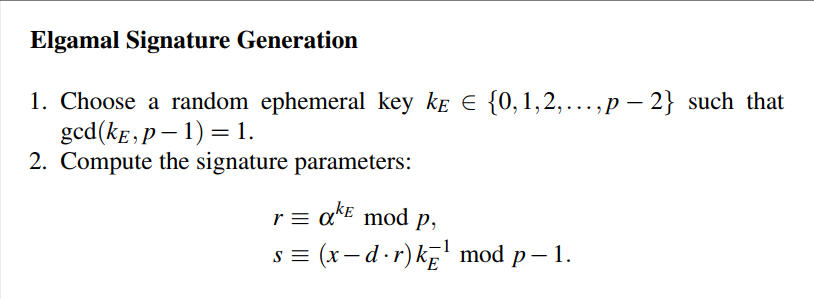

# Digital Signature 

## Objects of Security services 
1. Privacy
2. Integrity
3. Authentication
4. Non-repudiation: The sender of the message can't deny he sent it.
5. identification
6. Anonymity
7. Availability
8. Auditing
9. Access control
10. Physical security 

Digital signature is a security service that satisfies Non-repudiation objective.

## General idea 
- Generating a signature block unique to the message and the sender, and only the sender can generate that block for that message.
- Then the Generated block is attached to the message and sent with it.
- Only the sender can generate the signature, so it must be done using `Private key`.
- Anyone can verify that the sender is actually the one sending this message, so it must be done using the sender's `public key`.  
- It's also worth noticing that only `public key cryptography` is used in Digital Signatures, PKC techniques are mostly time consuming, also adding a signature of nearly same message size is inefficient, so we usually sign the message *hash value* not the message itself.  
- it's also worth mentioning that we can't use symmetric key cryptography for digital signatures. thetarget of Digital signature is to achieve non-repudiation, to achieve that, the key used for signature must be known only to the sender (this will be the basis for our argument that only the sender could have sent the message), in symmetric cryptography both sender and receiver share the same key (making our argument baseless since the receiver can send the message and generate the signature using the *shared key*).  

## Existential forgery attack 
This attack works basically for all school book DS schemes.
### Steps 
* the attacker intercepts the sender's `public key`.
1. the attacker generates some random signature *s*.
2. then compute *x'* using the know `pubic key` and generated signature *s*.
3. Send the message *x'* along with the signature *s* to the targeted receiver.
   
On the Receiver's side
1. The Receiver gets `(x, s)` from the attacker.
2. then attempt to verify it using the sender's `public key`.
3. Since the message *x* was generated by it from the beginning, then the verification succeeds, and the so does the attack.

**NOTE: This is the general idea of the attack, it may change a little depending on the problem at hand.**

### Results 
The attacker can send random messages to anyone pretending to be 'the sender' Bob, and the receiver would verify it as sent from Bob.  
But the attacker has no control over the sent message, so the attack is more like signal jamming than anything else.   
It can only be dangerous if the message transported is a key, so having no meaning is not a problem, and if Alice used it, he would be sharing data with the attacker who can now impersonate Bob.

### Protection
Add some padding to the message in a known method before the signature.
then the verification step can be done by first verfiying the signature.
then *verify the padding*: check if the padding was added correctly.
if any of those two conditions fail then the verification fails.

This solution works, since the attacker has no control of the message generated, and hence can't generate the padding correctly.

## Digital Signature Schemes 

### RSA School book Digital Signature 

#### Existential Forgery Attack Against RSA Digital Signature

#### Custom padding in RSA 
##### RSA Padding: The Probabilistic Signature Standard (PSS)

### El-gammal Digital Signature 
#### Key Generation
  
**The public key:** (p, &prop;, &beta;)  
**The private key:** d

#### Signature
  
The signature consists of two parts r and s, which are sent along with the message as (x, (r, s))
#### verification

#### Some security aspects
##### Reusing the ephemeral key 
KE is a key generated for each time the signature is made, and not part of the setup, and it shoudn't be reused, although the key itself is not sent, the value of *r* depends only on it, and the attacker can detect its repetition if r was repeated.  
if say we have two messages signed using same ephemeral key, then we have  
*s1 &equiv; (x1 - dr) * kE-1 &#8195; mod p-1*  
*s2 &equiv; (x2 - dr) * kE-1 &#8195; mod p-1*  
We can then start solving the two equations for kE  
*s1 − s2 ≡ (x1 − x2)kE−1 &#8195; mod p−1*  
*kE−1 = (x1 − x2) * (s1 − s2)-1 &#8195; mod p-1*  
Using kE−1 we can't compute *d*  
*d ≡ (x1 −s1 kE) r-1 &#8195; mod p−1*
##### Existential Forgery attack 
  

### Elliptic curve Digital Signature
#### key generation

#### Signature

#### verification

#### Some security aspects
same as elgammal digital signature, the ephemeral key must not be reused, and Existential Forgery attack is pretty much the same as well.
