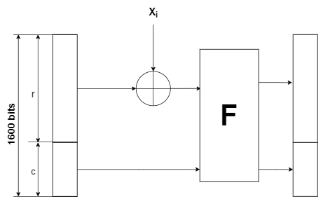

# Hashing 
A function that extracts the fingerprint of a given input sequence usually a file.  
or in other words for a given input sequence x, a hash function should generate an output h , called a digest, that is "unique" to x.

hash function can either be dedicated hash functions or Made out of Block Ciphers.
## Requirements of Hash Function
A hash function must satisfy some properties.
1. The input can have any length.
2. the output is fixed length.
3. **efficient**: *h(x)* is easy to compute.
4. **Preimage resistance**: it's practically infeasible to find a value x that has a given hash value h.
5. **Second preimage resistance**: it's practically infeasible to find a message x2 that has the same hash as a message x1.
6. **Collision Resistance**: it's practically infeasible to find two sequences x1 and x2 such that *h(x1) = h(x2)*.

## Birthday paradox
A collision is more inevitable as thanos, If you have a group of people that is larger than 365, there is for sure at least 2 with the same birthday.  

Same for hashing, with arbitrary input length, the number of possible inputs is huge, but the number of possible outputs is limited by the output size length, 2n (where n is the output fixed size), so a collision will surely occur, we can only make sure that those collisions are harder to find.  

the probability of finding collisions when input size is m and output size is N should be:  
  
for hashing N = 2n:  
  
The strength of the hash can be computed as the average number of steps needed to find a collision:  
  
Where λ is the possibility of finding a collision

## SHA-3
The new standard for hashing chosen by 2012 as a counter measure for the possible failure of SHA-2.  
As any hash function it has arbitrary input length, but the output can be 224, 256, 384 and 512 bits, that can be used depending on the application.  
Based on birth day paradox, the strength of a hash function is measured as *2n/2*, so those each of those bit lengths correspond to a different level of security.  
- 224 bits: 2112 same level of security as 3DES.
- 256 bits: 2128 same level of security as AES with 128 bit key.
- 384 bits: 2192 same level of security as AES with 192 bit key.
- 512 bits: 2256 same level of security as AES with 256 bit key.

This algorithm was mainly chosen because it was different from idea of SHA-1 and SHA-2, it uses the sponge construction.

### SHA-3 parameters 
1. Bus length b, for the original algorithm called keccak, it can have multiple values, for SHA-3 we only take the largest which is 1600.
2. Number of rounds for the `F function`, similarly to Bus length, SHA-3 only accepts largest value 24 rounds.

There are two more parameters r the block size, and C the capcity that differ based on the output size wanted.
|Output|   r  |   C  |
|------|------|------|
|  224 | 1152 |  448 |
|  256 | 1088 |  512 |
|  384 |  832 |  768 |
|  512 |  576 | 1024 |

note that r + c = b = 1600
### SHA-3 in action 
it has two main phases  
* Preprocessing: not counted and is mainly just padding, added to make the input a mutliple of block size, and apparently, it's not done trivially.
1. Absorbing (Preprocessing) phase 
2. Squeezing phase

#### Absorbing phase
  
This operation is done for all input blocks Xi iteratively until we reach the final result.   
We start from some chosen IV at the left, then apply the operation (adding Xi with xor then applying the F function), then the output is passed to the next stage, the output after processing the last input block is the output of the Absorbing phase.

##### The F function 
This function has 24 rounds (as mentioned above), each round has 5 steps, each step looks complicated so i'll ignore them. &#128578;

#### Squeezing phase 
This might seem a bit out of the blue, but we are done here.  
The output of the Absorbing phase, take the number of bits you need from it, that's all for SHA-3.  

For the actual algorithm which is more like a CPRNG, we apply the F function iteratively, reading the first r bits in each iteration.  

