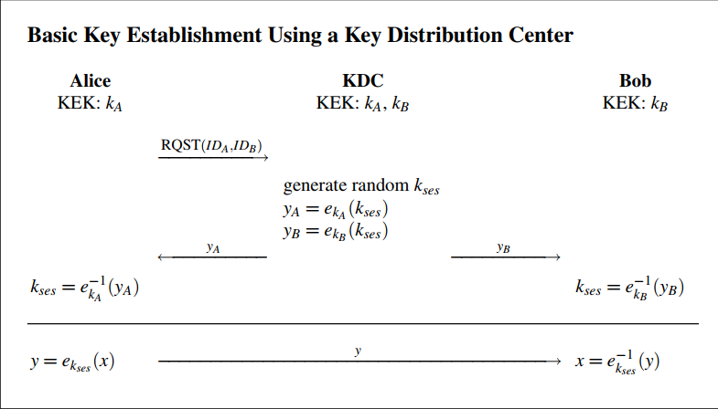
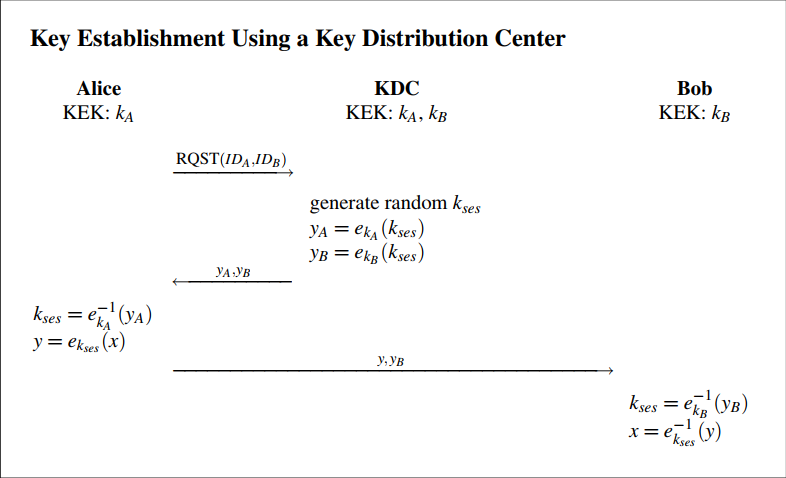

# Key Establishment
There are two methods to agree on the key to be used.
1. Key transport: the key is generated by one party then shared with the other party.
2. Key Agreement: Key is generated jointly by two parties involved, this is considered better since parameters of both parties are used when generating the keys, also the keyis not transported so as long as the Agreement communication can't be used to generate the key, it would be secure, it's also used to make sure no one party controls the key generation.

## The n^2 distribution problem
problem statment: How many keys are required for the commuincation between n users on a network?

### Naive approach
For the communication between any two users, they need to have a shared key, so each user will keep n-1 keys, to contact other users, for a total of n * (n-1) keys.  
For all possible combinations we have n*(n-1)/2 unique keys.  

The large number of keys is not the only problem, the insertion of a new user is also problematic.  
When a new user is added we need to generate n pairs of keys to allow him to communicate with other users, and those keys must be shared with all other users, for large systems, this will take considerable amount of time.  

## Key Establishment with key distribution center (DC)
The DC is a device that generates and transports keys between users. the whole system would follow a star topology with the DC in the middle.  
There are 3 approaches that use a distribution centerto transport the key between different users.

***P.S.:** The 3 names used below are made up by me to make some relatable headers, and not mentioned in book.*

### DC in the middle
The DC generates a unique key for each user and delivers it to him in a secure channel.

If user A with key **kA** wants to send message x to user B with key **kB**.
User A would encrypt the message x as  
*y1 = EKA(x)*  

Then send it to the DC who in turn would decrypt the message with A's key  
*x = DKA(y1)*   
then encrypt it again with B's key  
*y2 = EKB(x)*  
and sends it to B 

who in turn would decrypt the message using his own key 
*x = DKB(y2)*   

However this approach has few problems:
1. The DC is actively participating with sending the message, and can view it.
2. The DC will handle communication between all users, making it a communication bottle neck.

### End-to-End Encrption

here the session key is used to share messages between A and B directly not passing by the DC, but stillsince the DC generates the session key it stillcan decrypt the message, however the message shouldn't find its way to the DC.

### End-to-End encryption++
  
Same as the above except, it passes the encrypted session key of B to A, and now sharing the session key is the responsibility of A, he would send it along with the encrypted message.  
On the receiving end, B would decrypt the session key, and then use it to decrypt the message.

### Problems of using DC
1. relying on the DC makes the system a one-point-of-failure system, if the DC is down, the system is down.
2. The system doesn't support *Perfect Forward secrecy*, since the attacker can access old data if he managed to obtain some secret key.

Let's say the attacker tricked A and got his key kA, then A who realized that (hopefully he did), A asked the DC for a new key, with that all new communicate would be secured, but how about old communication.   

If the attacker has all the communication records of A, he can find the session keys he shared with other users, and use them to decrypt all old communication.
