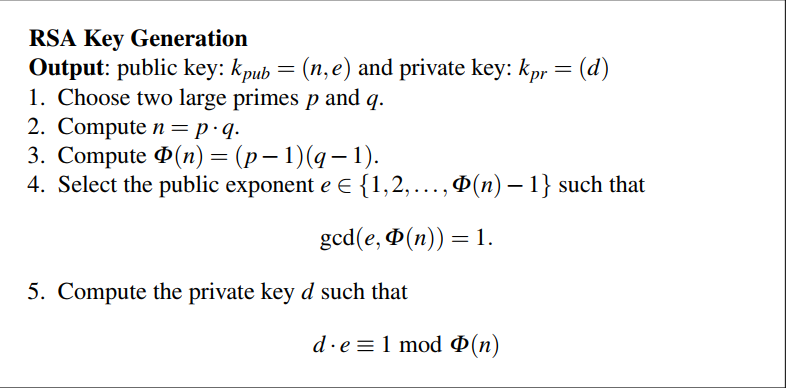
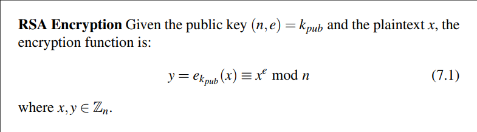
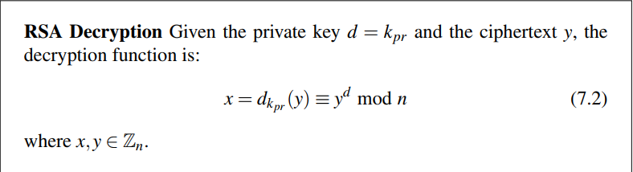
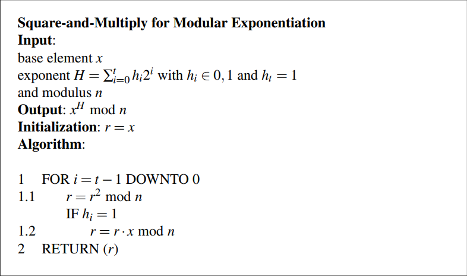

# RSA 
## Public key cryptography
### Main idea 
The main idea of PKC is the use of mathematical problems that satisfy 2 conditions
1. Easy in the forward path. (easy to compute y given x)
2. hard to reverse. (hard to determine x given y)

There are two famous such problems (we usually call the problem by the reverse path name):  
1. factorization: it's easy to compute a number given its prime factors, but hard to compute the prime factors given the number, especially very very largte numbers.
2. Discrete Logarithm Problem (DLP): it's easy to compute *r = x<sup>e</sup> mod m* but hard to compute *d* given x and r, more on that in [chapter 8](../Ch8/readme.md)/

### adavntages of using PKC:  
1. No need for a Secure channel:  
   Every user generates two keys: **public key** and **private key**.  
   - the public key of user A is announced to all others who can use it to send messages to him.
   - The private key of user A is kept hidden and used to decrypt messages coming to the user.
   So there is no need to have a secure channel for key exchange.  
2. *PKC: Starting today, There is no secure channel, **i'm the secure channel**.*  
   it can be used to make a secure channel to exchange *symmetric keys*.
3. Can be used for Digital Signature:
   Since only the sender knows his private key, it can be used to sign messages to verify the sender, more on this on [Chapter 10: Digital Signatures](../Ch10/readme.md).

### Drawbacks of using PKC:
1. They are much slower thanv symmetric encryption algorithms.
2. They can only be used to encrypt small messages.
## RSA 
It's a PKC system that depends on the factoriation problem.
### Key generation
Arguably the most complicated part of RSA  


### RSA Encryption


### RSA decryption


### Security and computational aspects
1. The factorization problem despite being hard, there are many algorithms for prime factorization, the strongest of whom is *number field sieve* (as far as i know), so to mnake the system secure the value of n must have at least 1024 bits, or even 2048 bits, to be secure against attacks.
2. Note: the private key must have at least 0.3 the number of bits of n.
3. The computations of the power for such large values would be time consuming, so we have multiple methods to make this faster:
   1. Square and multiply algorithm
   2. Chinease Remainder Theorem (CRT)
   3. Choose small public key to make the encryption easier, and so the private key will be larger, so use CRT with Decryption.
4. RSA is a deterministic scheme (same input gives same output).
5. For small exponent, and small plain text, attacks are possible when no padding is used.
6. RSA scheme is malleable, the attacker can change the plain text without having to decrypt the message.  
   let y = x<sup>r</sup> is the encrypted text.  
   To add the value s to the message, the attacker can compute y' = s<sup>e</sup>.  
   Then attack it to the message like this y := y * y' =  s<sup>e</sup> * x<sup>e</sup>.  
   The receiver will decrypt y as x = D<sub>d</sub>(y) = (s * x)<sup>d * e</sup> = s * x
## Fast Exponentiation Square and Multiply algorithm
This is the iterative approach, it's bit odd to see it from book.  
Just to make it easier to read:  let's say you calculate 9<sup>85</sup>  
* x: is the base element 8.  
* H: is the binary representation of the exponent.
* t: is the number of bits.



The more "human" way to apply that (as you would likely do in exams):  
to compute *result = x<sup>e</sup>*
* make a table of 2 columns `exponent` and `result`.
* start the first row with exponent and x respectively.

```python
if e is even:
  divide e by 2.
  multiply result by itself.  
else  # e is odd:
  decrement e by 1.
  multiply result by x.
if e is not 1: repeat from step 1.
else the final result is the answer.
```