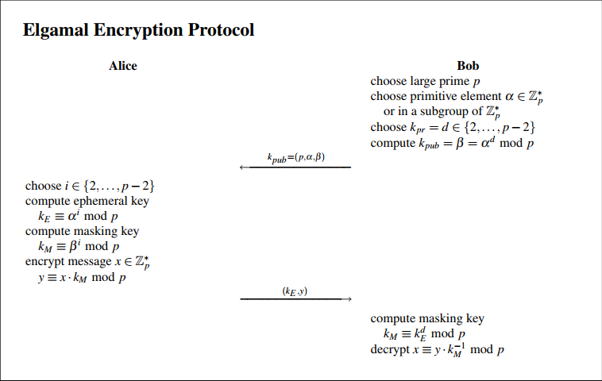

# Chapter 8: Public key cryptography based on Discrete Logarithm Problem

This section requires knowledge of [group theory](../Math/group-theory.md) before hand.

## DLP: Discrete Logarithm Problem
- this is the one way function based on which many cryptography schemes are made including but not limited to the ones mentioned here.
### Problem statment

- It's easy to compute *&beta;* given *&prop;* and *x*, but computing the *logarithm x = log*&prop;*(*&beta;*)* is the hard problem.

- DLP is based on [group theory](../Math/group-theory.md), the difficulty of the DLP is that you can't mathematically solve it, you need to examine all the possible numbers that can be generated by element *&prop;* while counting the steps needed to reach *&beta;* which is *x*. so the security of DLP depends on the number of elements that can be generated from *&prop;*, as minimum number required depends on the nature of the group.

- DLP is solved for groups using *simple addition* operation in mod m, it can be reduced to computing the inverse problem, as long as the chosen *generator* coprimes with m, we can solve it directly as
_
x = &prop;-1 &beta; mod m
_

## Deffie-Hellman key exchange algorithm

- Deffie-Hellman is based on Group &Zopf;*_p_

## Attacks against Deffie Hellman

### Generic Methods
Attack the generalized DLP not specific to certain groups
#### 1 - Brute Force
- Apply the operation to *&prop;* repeatedly until *&beta;* is reached, the number of iterations needed is x.
- Its complexity is &Oopf;(*ord(&prop;)*), using a primitive element this is essentially &Oopf;(*|G|*).
- So this attack fails if *|G|* is >= 280.

#### 2 - Shank's method (Baby step Giant Step)
- A divide and Conquer approach
Let m = &radic;(*|G|*).  
we can define x as x = xg m + xb  
now the DLP can be written as  
_&prop;xb &equiv; &beta; &prop;-m xg_  

1. Generate all possible values of xb &isin; [0 .. m-1].
2. compute values of _&beta; &prop;-m xg_ &isin; [0 .. m], for each value check if it exists in the generated values in previous step, and stop once found.
   
- Complexity = &Oopf;(&radic;*|G|*)
- to safeguard against this attack *|G|* should be >= 2160.

#### 3 - Pollard Rho Method
- Based on Brithday Paradox
- Randomly generate numbers of the form _&prop;i&beta;j_
  given that _&beta; = &prop; x_, then the previous form can be written as _&prop;i&beta;xj_
- Wait until a collision is found, then  
  _&prop;i1 + x j1 = &prop; i2 + x j2 &#8195;&#8195; mod |G|_  
  _i1 + x j1 = i2 + x j2 &#8195;&#8195; mod &phi;(|G|)_  
  _x = (i2 - i1 ). (j1 - j2)-1 &#8195;&#8195; mod &phi;(|G|)_  

- It's the best known attack for elliptic curve cryptosystems.  
- Complexity = &Oopf;(&radic;*|G|*).
- to safeguard against this attack *|G|* should be >= 2160.

#### 4 - Polhig Hellman method
- Based on chinease remainder method.
- Used as a preprocessing step for other methods to make them faster.
- It's a divide and Conquer algorithm, it defines |G| as  
  _|G| = p1e1 p2e2 p3e3 p4e4 ... pnen_

- Use any of the above methods to solve DLP in smaller sub groups G(piei).
- Then combine the results to compute _x_ using chinease remainder method.

### Non-Generic Algorithms
Attacks that are specific to certain groups or under certain conditions

#### Index Calculus Method
- It targets groups _Z*p_ and _GF(2m)_.
- It works in groups where large elements can be represented as a product of small elements.
- This is a very strong attack, but doesn't work on elliptic curve cryptosystems.
- to safeguard against this attack *|G|* should be >= 21024.

### Security of DHKE

- Group size must be >= _21024_ for _DHKE_ to be secure
- IT'S NOT SECURE AGAINST _ACTIVE ATTACKS_ like: _replay_, _generating false messages_, and _message modification_.

## Elgammal Encryption scheme

The above is a simple representation of the algorithm, that uses DHKE to exchange the key, then encrypt the message with simple multiplication then.

The actual scheme is as follows:

- Since K m is multiplied with x, it's called a _Masking key_.
- it's a probablisitic scheme, running the algorithm multiple times should have different result, depending on the chosen value for i, the private key of alice, which is changed every time a message is sent.  
- The protocol is used to transfer messages in one direction, you need to have a different process for the other direction to send messages as well.
- This method needs to send double the amount of data since the K E needs to be sent with _y_ to the other side.
- Unlike DHKE, the parameters _p_ and _&prop;_ are generated by one of the two involved parties and not a trusted thrid party.
