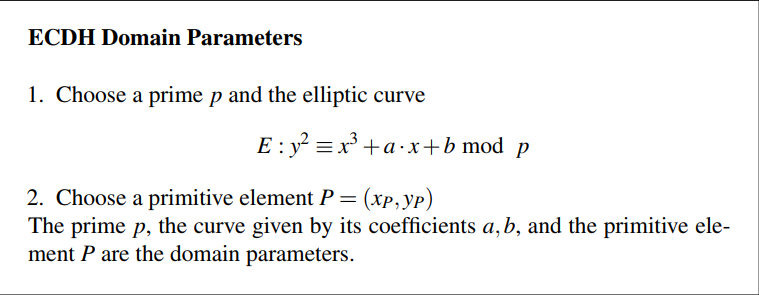
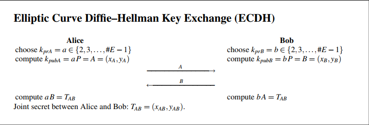

# Elliptic Curves Cryptosystems 
- Cryptosystems based on DLP in elliptic curves are very strong, and efficient.
- Unlike `RSA` or `DHKE`, encryption that require `1024` bit length to achieve security, elliptic curves can achieve same level of security with just `160` bits, making it more efficient in time and space.
- Chapter 9 of understand cryptography discusses one algorithm based on this, which is simply re-implementing DHKE using Elliptic Curve groups. 

## DHKE with Elliptic Curves 
- First step is the setup phase.  
  
- Key exchange step  
  

## Attacks 
Generic attacks against DHKE are valid so it needs `160` bits to be secure.  
However the non-generic attacks like `Index Calculus Method` that forces us to use 1024 bits for DHKE in Z*p won't work against elliptic curves, so `160` bits are enough to reach a high level of security.

one final but crucial Quote from the book:

> It should be stressed that this security is only achieved **if cryptographically strong elliptic curves are used**. There are several families of curves that possess cryptographic weaknesses, e.g., supersingular curves. They are relatively easy to spot, however. In practice, often **standardized curves** such as ones proposed by the National Institute of Standards and Technology (NIST) are being used.
