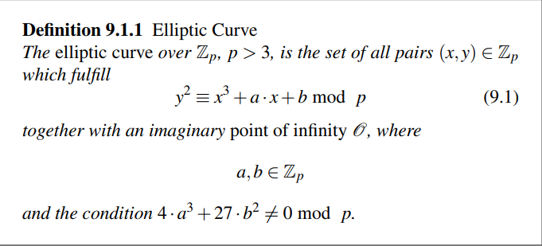
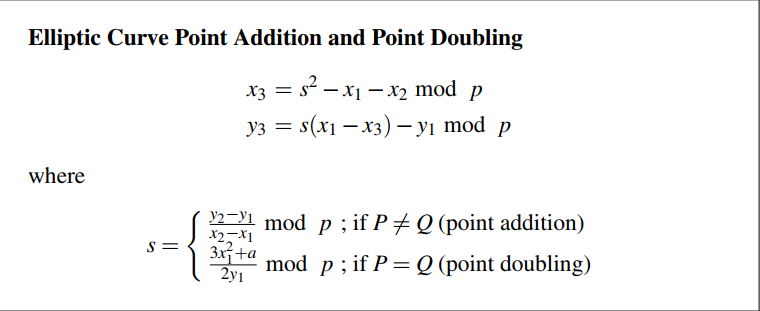
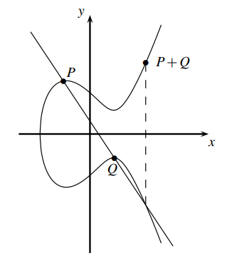
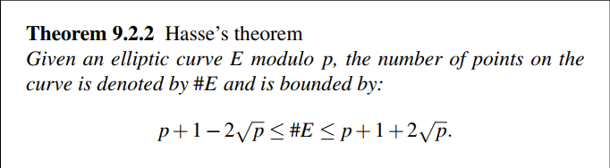
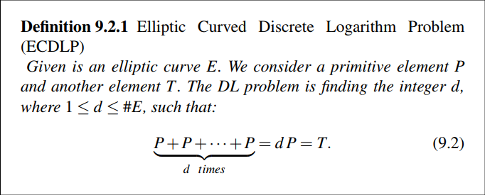

# Math for cryptography
This file includes a summary for the rules needed through out the book, without the explanation or proof of them, it includes the rules, what they imply, and how to use them.

## Finding inverse using extended euclidean algorithm 
Problem statement: find the inverse of a given number *n*, in modulus *m*, given that n and m are coprimes. 

Input: the number to find the inverse of n, and the mod m.  
Solution steps:
Let's define m as r0, and n as r1, and i := 2.
1. Compute qi = floor(ri-2,ri-1).
2. Compute ti = ti-2 - qi ti-1.
3. Compute ri = ri-2 - qi ri-1.
4. `If` ri = 1, `then` **ti is the inverse of n.**
`Otherwise` jump to step 1, with i := i + 1.

If it didn't reach 1, then n and m aren't co-primes. 

## Group Theory
- A group is defined by a set of _elements_ and and operation _&omicron;_ that satisfy the following rules:
- **The group is closed**: for any two elements _x_ and _y_, _c = x &omicron; y &isin; G_
- **Neutral element**: there must be Neutral Element _N &isin; G_ such that _x &omicron; N = x_
- **Inverse**: for any element _x &isin; G_ there exists an element _x-1 &isin; G_ sch that _x * x-1 = N_.
- **Associativity**: the operation &omicron; is associative

### Abelian Groups (Not really important)
- A group is called **Abelian** if the operation &omicron; is commutative.
- Abelian groups are generally simpler to analyze than nonabelian groups.
- Any subgroup of an abelian group is also abelian.
- Any quotient group of an abelian group is also abelian.
- The direct product of two abelian groups is also abelian.

### Finite Groups
A group is called **finite** if it has a finite number of elements.

### Order of Group and Order of element 
- The Cardinality of the group: the order of the group: |G|: the number of elements in the group.
#### The order of an element:  

The representation ak makes it look like multiplication, but we mean any operation &omicron; in general, so we would denote this as _f(a, k)_ here to avoid confusion.
- ord(a) can only be computed by applying *f(a, k)* with different values if k incrementally until the Neutral element is reached, the first (smallest) value of k such that *f(a, k) = N* is ord(a). 
- The maximum order of an element = |G|.
- Generally speaking:  
  
which is a generalization of euler's theory.

#### primitive elements 
- An element with that maximum order is called _primitive element_ or _generator_, since it can be used to generate all numbers of the group this way.
- A group with at least one primitive element is called *cyclic group*.
- The number of primitive elements in a group _G_ is _&phi;(|G|)_, the number of coprimes of |G|.
- If |G| is prime, all elements of G are primitive (except for the Neutral element of course).

### Cyclic Groups
- A group is called **Cyclic** if it includes a *primitive elemnt &prop;*.
- A Cyclic group mostly finite, but there are also some infinite cyclic groups beyond our scope here.
- This Book is only interested in finite groups, and Ch8 is specifically interested in finite cyclic groups.

### Sub groups 
- Smaller groups generated by the Non-primitive elements of a large group G are called subgroups.
- *Lagrange's Theorem:* let a be a non-primitive element of G and generates subgroup H, since ord(a) divides |G|, then |H| divides |G|.  
- The order of a subgroup is the order of its generator.

### examples of groups
All groups used in cryptography (at least here) are `abelian`, `finite`, `cyclic`
- _Z*p_: multiplicative group, and elements are [1 .. p-1], it's used in DHKE, elgammal encryption scheme and digital Signature.
- Elliptic Curves: additive group, but the addition is "not simple", and the elements are points on the elliptic curve under some modular m.
- GF(2m): used for AES, but DLP has multiple strong attacks in this groups, so it's not used.
- Hyper-elliptic Curves: they are a generalization over elliptic curves that have shorter operand lengths, rarely used in practive currently.

## Elliptic Curves Groups
- A special type of Groups that has strong cryptographic properities.

- As shown in the above pic, elements of the group are points on the chosen curve.
- operation of the group is called "addition" but it's definied in a special way  
  let *p = (x1, y1), Q = (x2, y2)*  
  we can compute *R = P + Q = (x3, y3)* as follows

 

- The point *&bcy;* is an imaginary point at infinity that acts as a neutral element for the group.

### Primitive element
- let *&prop;* be a primitive element of elliptic curve group *G*, then *|G| * &prop; = &bcy;*, since we denote the operation in this group by `+` sign, we can denote the repeated application of this operation as `*` multiplication (analogous to power operation in multiplicative groups).
- The operation *k * &prop;* is often computed in cryptography, in order to compute it efficiently we use **double and add algorithm** (same as power and multiply algorithm except changing `*` to `+`).

- An important side note *Hasse’s theorem*:
   
### DLP in Elliptic curves
  
Computing the multiplier *d* is the DLP in the domain of Elliptic curves.
